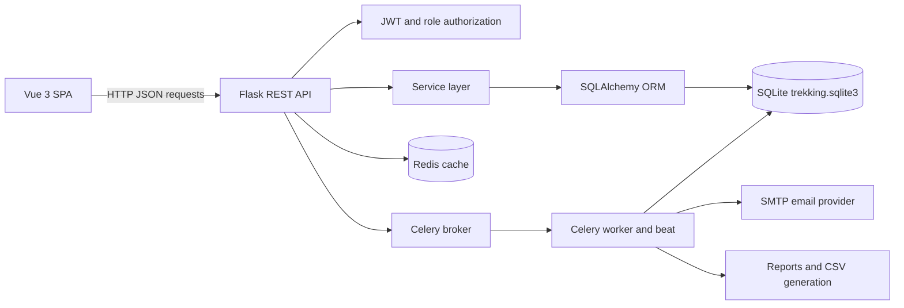
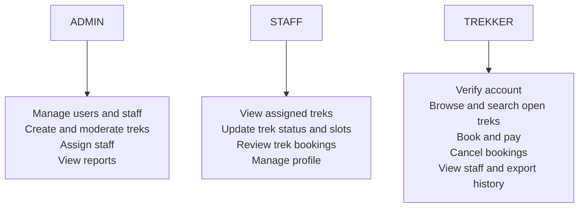
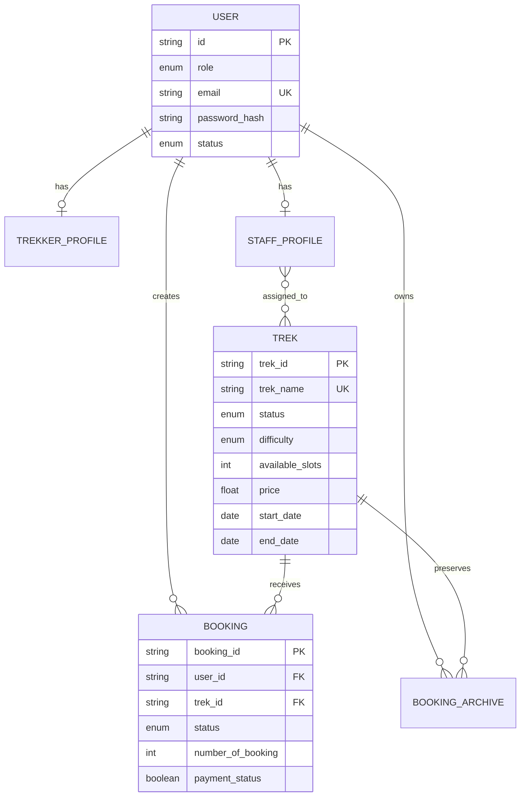
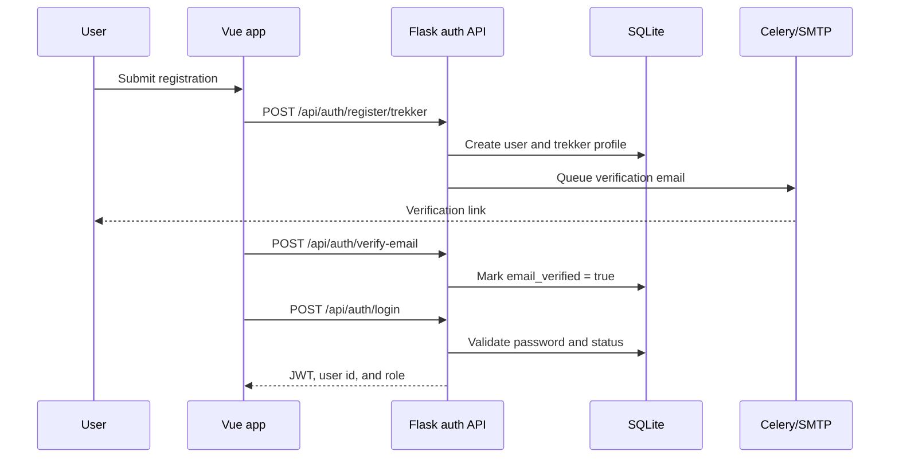
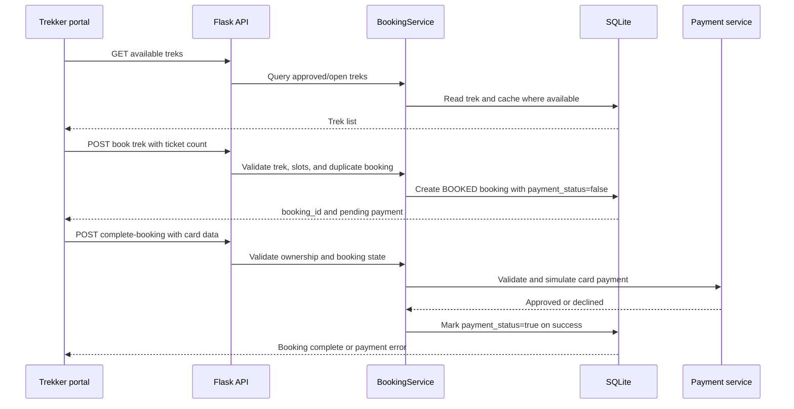

# Trekking Management Application - MAD2 Project

This is my Modern Application Development 2 (MAD2) project on a Trekking Management Application.  
**(Roll No.: 23f2003086)**

---

## Project Architecture

```text
├── backend
│   ├── api/              # API endpoints for admin, staff, and trekkers
│   ├── auth/             # Authentication, role-based access, and JWT logic
│   ├── core/             # Application configuration and security settings
│   ├── database/         # SQLAlchemy models and database session management
│   ├── db/               # SQLite database file (trekking.sqlite3)
│   ├── service/          # Core business logic used by routes and tasks
│   ├── tasks/            # Celery workers for background jobs (emails, payments)
│   ├── app.py            # Main Flask application entry point
│   ├── cache.py          # Caching instance initialization (Redis)
│   ├── celery_app.py     # Celery instance and scheduler setup
│   ├── requirements.txt  # Python dependencies
│   └── start.bat|.sh   # Startup script for backend services
└── frontend
    ├── src/
    │   ├── components/   # Reusable UI components (admin, user, shared)
    │   ├── routers/      # Vue Router configuration and navigation guards
    │   ├── views/        # Page-level layouts categorized by portals (admin, auth, staff, user)
    │   ├── App.vue       # Root Vue component and layout wrapper
    │   └── main.js       # Main Vue app entry point and plugin initialization
    ├── index.html        # Main HTML template
    ├── package.json      # Node.js dependencies and scripts
    └── vite.config.js    # Vite build tool and dev server configuration
```

---

## System Design

The application is a role-based trekking management system. The Vue single-page application communicates with a Flask REST API. Flask applies authentication and authorization, delegates business operations to service classes, and uses SQLAlchemy to persist data in SQLite. Redis provides both the cache and the message broker/result backend used by Celery.



### Main Layers

| Layer | Location | Responsibility |
| --- | --- | --- |
| Presentation | `frontend/src/views`, `frontend/src/components` | Login, registration, dashboards, trek browsing, bookings, profiles, reports, and reusable UI. |
| Routing | `frontend/src/routers/index.js` | Maps public pages and role portals to Vue views. |
| API | `backend/api`, `backend/auth` | REST endpoints, request validation, JSON responses, JWT authentication, and role checks. |
| Business services | `backend/service` | Trek, booking, user, staff, password, registration, and reporting rules. |
| Persistence | `backend/database` | SQLAlchemy models, relationships, association tables, and database sessions. |
| Platform services | `backend/cache.py`, `backend/celery_app.py` | Redis caching and asynchronous task configuration. |
| Background jobs | `backend/tasks` | Email, reports, exports, reminders, booking archival, and scheduled maintenance. |

### Application Startup

1. `backend/app.py` loads `.env` and Flask configuration.
2. Redis cache settings and JWT handling are registered.
3. Authentication, admin, staff, and trekker blueprints are mounted below `/api`.
4. SQLAlchemy creates missing tables in `backend/db/trekking.sqlite3`.
5. A default administrator is created when no admin exists.
6. The backend starts on port `8000`. The startup process also launches a Celery worker; Celery Beat schedules are configured in `backend/celery_app.py`.
7. Vite serves the Vue application on port `5173` during development.

### Roles and Responsibilities



Every protected request carries a JWT access token. The token contains the user identity and a `role` claim. The `role_required` decorator validates the token and rejects callers whose role does not match the endpoint. Admin tokens expire after two hours; staff and trekker tokens expire after 24 hours. Suspended accounts cannot log in.

### Core Data Model



The `User` table is shared by all roles. Trekker and staff details are stored in one-to-one profile tables. `Booking` connects trekkers to treks and prevents duplicate user/trek bookings with a unique constraint. Historical records can be copied into `BookingArchive` before the active record is removed.

## End-to-End Flows

### Authentication and Account Verification



Staff accounts are created by an administrator. Passwords are stored as hashes. Password reset uses an emailed token, and trekker accounts must be email-verified before login is accepted.

### Trek Management

1. An admin creates a trek through the admin portal. New treks are initially `PENDING`.
2. The admin changes the trek status as it is reviewed and made available. `OPEN` treks appear in the trekker list.
3. The admin assigns one or more staff members through the many-to-many staff/trek relationship.
4. Assigned staff can view the trek, update available slots, and change operational status.
5. When a trek passes its due date, the scheduled auto-close task changes its availability/status. Existing bookings can be archived by a background task when historical preservation is needed.

### Booking and Payment



The payment module is a local simulation, not a production payment gateway. It validates card-shaped input and may randomly decline a transaction. Trekker users can cancel a booking, view assigned staff, or request an asynchronous CSV export containing current and archived bookings.

### Background Processing and Scheduled Work

Celery uses Redis as its broker and result backend. Tasks are retried where configured, so email delivery and report generation do not block normal API requests.

| Job | Trigger | Result |
| --- | --- | --- |
| Verification, suspension, activation, and trek email | Registration or management event | Sends SMTP email asynchronously. |
| Booking CSV export | Trekker requests an export | Returns a task id; the frontend polls until the CSV is ready. |
| Daily trek reminders | Celery Beat, daily at 08:00 | Queues countdown emails for upcoming bookings. |
| Auto-close past treks | Celery Beat, daily shortly after midnight | Closes treks whose dates have passed. |
| Monthly admin report | Celery Beat, first day of the month at 06:00 | Generates and sends the scheduled report. |
| Booking archival | Service/task trigger when historical data is needed | Copies booking details and historical trek dates to `BookingArchive`. |

### Caching Strategy

Redis-backed Flask-Caching is used for frequently read lists, including available treks, staff, and trekkers. Mutating operations explicitly invalidate relevant cache keys after creating, updating, deleting, assigning, or changing the status of records. Search and user-specific booking operations use live service queries.

## API Surface by Blueprint

| Prefix | Consumers | Representative operations |
| --- | --- | --- |
| `/api/auth` | Public pages and admins | Login, trekker registration, staff registration, email verification, forgot/reset password. |
| `/api/admin` | Admin portal | User status changes, staff management, trek CRUD, staff assignment, search, reports, and exports. |
| `/api/staff` | Staff portal | Assigned trek list, trek status/slot updates, trek bookings, and staff profile. |
| `/api/trekker` | Trekker portal | Profile, available/searchable treks, bookings, payment completion, cancellation, assigned staff, and booking export. |

## Frontend Navigation

The Vue Router defines four public authentication pages and three portal shells:

* `/` and `/register` provide login and trekker registration.
* `/reset-password` and `/verify-email` complete account recovery and verification.
* `/dashboard/*` contains admin staff, user, trek, and report views.
* `/staff/*` contains assigned treks and the staff profile.
* `/trekker/*` contains available treks, booked treks, and the trekker profile.

Shared components such as `AppSidebar`, `AppTopbar`, `StatusBadge`, `SearchBar`, booking/payment modals, and profile components keep portal interactions consistent. Page views own portal-specific data loading and actions, while Flask services own validation and state changes.

## Challenges Faced

* **Setting up Celery and Redis:** Configuring the background workers and Redis database required studying documentation and utilizing AI (Gemini) to get both running smoothly.
* **Email Service Integration:** Implementing the SMTP protocol to send automated emails to specific users was a new concept to learn and integrate into the Flask app.
* **Frontend Routing:** Figuring out the proper way to configure Vue Router so that all components navigate and work seamlessly across different role-based views.
* **Chart.js Integration:** Being new to both Chart.js and Vue.js, I relied on documentation, video lectures, and Gemini to build the analytical dashboards.

---

## How to Run the Project

### 1. Frontend Setup

Navigate to the frontend directory, install the required npm packages, and start the development server:

```bash
cd frontend
npm install
npm run dev
```

### 2. Backend Setup

Navigate to the backend directory and create a Python virtual environment.

**For Linux / macOS:**

```bash
cd backend
python3 -m venv .venv
source .venv/bin/activate
```

*(Alternatively, use `uv init` if you prefer using uv).*

**For Windows:**

```cmd
cd backend
python -m venv .venv
.venv\Scripts\activate
```

*(Alternatively, use `uv init` if you prefer using uv).*

### 3. Redis Setup (Required for Celery & Caching)

Redis must be running in the background before you start the backend server.

**For Linux (Ubuntu/Debian):**

1. Install Redis:
```bash
sudo apt update
sudo apt install redis-server
```


2. Start the Redis service:
```bash
sudo systemctl start redis-server
```


*(To ensure it's running, you can type `redis-cli ping`. It should reply with `PONG`).*

**For Windows:**
Since Redis doesn't officially support Windows natively, you have two options:

* **Option A (WSL - Recommended):** Open your Windows Subsystem for Linux (WSL) terminal and run the exact same commands listed in the Linux section above.
* **Option B (Native Windows Port):** 1. Go to [https://github.com/tporadowski/redis/releases](https://github.com/tporadowski/redis/releases).
2. Download the latest `.msi` file and install it.
3. Once installed, Redis automatically runs as a background Windows service (you don't need to start it manually). You can verify it's working by opening Command Prompt, typing `redis-cli`, and then typing `ping`.

### 4. Environment Variables (`.env`)

Create a `.env` file in the root of your `backend` folder and add the following configuration:

```env
SECRET_KEY=your-secret-key
JWT_SECRET_KEY=your-secret-key-jwt
API_BASE=/api
API_SERVER_URL=http://localhost:8000

REDIS_URL=redis://localhost:6379/0
CACHE_TYPE=RedisCache
CACHE_DEFAULT_TIMEOUT=300

EMAIL_USER=example@gmail.com
EMAIL_PASS=hykc scbc dksi ksok
EMAIL_OTP_SALT=email-otp-salt
```

> **Note on `EMAIL_PASS`:** This is your 16-character Google App Password. You can generate it by navigating to your Google Account -> Security -> 2-Step Verification -> App Passwords, or you can go directly to this link to generate it: [https://myaccount.google.com/apppasswords](https://myaccount.google.com/apppasswords).

### 5. Start the Backend Server

Once your virtual environment is active, Redis is running, and the `.env` file is set up, run the startup script to boot the backend services (Flask and Celery).

**For Linux / macOS:**

```bash
./start.sh
```

**For Windows:**

```cmd
start.bat
```

---

## Accessing the Application

Once both the frontend and backend servers are running, you can access the application using the links below:

* **Frontend:** [http://localhost:5173/](https://www.google.com/search?q=http://localhost:5173/)
* **Backend:** [http://localhost:8000/](https://www.google.com/search?q=http://localhost:8000/)

### Default Admin Credentials

To access the administrator dashboard, use the following credentials:
* **Email:** `admin@tma.com`
* **Password:** `Admin@1234`
